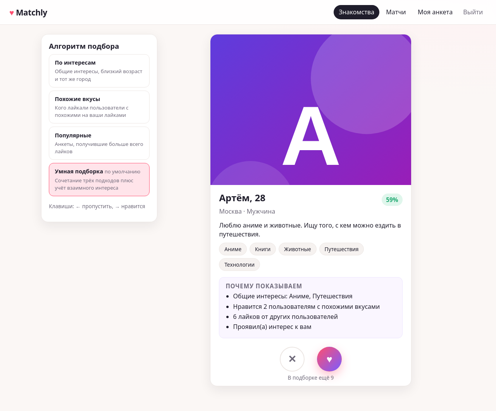

# Matchly

Сервис знакомств с модулем персональных рекомендаций. Учебный проект: backend на Spring Boot с PostgreSQL,
Spring Security (JWT), Swagger и веб-интерфейсом.



## Возможности

- Регистрация и вход по email и паролю, JWT, роли `USER` и `ADMIN`.
- Анкета: имя, возраст, пол, кого ищем и в каком возрасте, город, интересы из справочника, фото (хранится в базе).
- Лента «Знакомства»: карточки с объяснением «почему показываем», лайк и пропуск, переключение алгоритма.
- Четыре алгоритма рекомендаций: по интересам, коллаборативная фильтрация, по популярности, гибрид.
- Взаимный лайк создаёт матч и раскрывает контакт собеседника. Матч можно разорвать.
- Панель администратора: статистика, пользователи (блокировка, удаление), справочник интересов, алгоритм по умолчанию.
- Демо-данные при первом запуске: 60 анкет с аватарами, лайками и матчами.
- Swagger UI, логирование в консоль и файл, единый формат ошибок (RFC 9457 `application/problem+json`).

Подробное описание архитектуры и алгоритмов: [docs/REPORT.md](docs/REPORT.md).
Как встроить модуль рекомендаций в другое приложение: [docs/INTEGRATION.md](docs/INTEGRATION.md).

## Стек

Java 21, Spring Boot 4.1 (Web MVC, Data JPA, Security, Validation, Actuator), PostgreSQL 16, Flyway,
springdoc-openapi (Swagger UI), Lombok, JUnit 5, Mockito, H2 (только для тестов), интерфейс на HTML/CSS/JavaScript без сборки.

## Быстрый старт

Единая точка входа: скрипт `start.sh` (Linux, macOS) или `start.cmd` (Windows) в корне проекта.
Он проверяет Java, находит или поднимает PostgreSQL и запускает приложение вместе с интерфейсом.

| Команда | Что делает |
|---------|------------|
| `./start.sh` / `start.cmd` | локальный режим: нужна Java 21; если PostgreSQL не отвечает, база поднимается в Docker автоматически |
| `./start.sh --docker` / `start.cmd --docker` | всё в Docker одной командой: собирает образ, поднимает базу и приложение (Java на машине не нужна) |
| `./start.sh --stop` / `start.cmd --stop` | останавливает контейнеры |
| `./start.sh --test` / `start.cmd --test` | прогоняет автотесты (база не нужна) |

После запуска интерфейс доступен на http://localhost:8080. Первый запуск скачивает зависимости (2-3 минуты),
дальнейшие занимают секунды. При первом старте создаются схема базы, администратор и 60 демо-анкет.

### Вариант 1. Всё в Docker

Нужен только Docker (на Windows и macOS: Docker Desktop).

```bash
./start.sh --docker        # Windows: start.cmd --docker
```

Это эквивалент `docker compose up --build`. Данные базы и логи хранятся в томах Docker и переживают перезапуск;
`docker compose down -v` удаляет их.

### Вариант 2. Локально: Java 21 + PostgreSQL

**Шаг 1. JDK 21.**

Windows (PowerShell):

```powershell
winget install EclipseAdoptium.Temurin.21.JDK
```

Откройте новое окно терминала и проверьте: `java -version` показывает `21`. Если команда не найдена, задайте `JAVA_HOME`
(например, `C:\Program Files\Eclipse Adoptium\jdk-21.x.x-hotspot`) и добавьте `%JAVA_HOME%\bin` в `PATH`.

Linux (Ubuntu/Debian):

```bash
sudo apt install openjdk-21-jdk
```

Без прав администратора распакуйте [Temurin JDK 21](https://adoptium.net/temurin/releases/?version=21) в `~/.jdks`:
`start.sh` найдёт его сам.

**Шаг 2. PostgreSQL.** Нужна база `matchly_db` и роль `matchly` с паролем `matchly` (меняются через `.env`, см. ниже).
Если Docker установлен, этот шаг можно пропустить: `start.sh` поднимет базу в контейнере сам. Иначе:

- Windows: установите PostgreSQL 16 (`winget install PostgreSQL.PostgreSQL.16` или установщик с
  [postgresql.org](https://www.postgresql.org/download/windows/)) и выполните из папки проекта
  `& "C:\Program Files\PostgreSQL\16\bin\psql.exe" -U postgres -f infra\init-db.sql`.
- Linux: `sudo apt install postgresql` и `sudo -u postgres psql -f infra/init-db.sql`.
  Без прав root можно поднять кластер от своего пользователя: `infra/pg-local.sh start`, затем
  `psql -h localhost -U postgres -f infra/init-db.sql`.

Скрипт `infra/init-db.sql` идемпотентен. Таблицы создаёт само приложение (Flyway).

**Шаг 3. Запуск.**

```bash
./start.sh                 # Windows: start.cmd  (в PowerShell: .\start.cmd)
```

Альтернатива без скриптов: `./mvnw -DskipTests package` и `java -jar target/matchly.jar`
(Windows: `mvnw.cmd -DskipTests package`).

### Адреса и учётные записи

| Что | Адрес |
|-----|-------|
| Интерфейс | http://localhost:8080 |
| Swagger UI | http://localhost:8080/swagger-ui.html |
| OpenAPI JSON | http://localhost:8080/v3/api-docs |
| Проверка состояния | http://localhost:8080/actuator/health |

| Роль | Email | Пароль |
|------|-------|--------|
| Администратор | `admin@matchly.local` | `admin123` |
| Демо-пользователи | `demo1@matchly.local` … `demo60@matchly.local` | `demo1234` |

В Swagger нажмите **Authorize** и вставьте токен из ответа `POST /api/auth/login`.

## Настройка

Все параметры задаются переменными окружения или файлом `.env` в корне проекта (шаблон: `.env.example`).
Файл `.env` читают и `docker compose`, и скрипты `start.sh` / `start.cmd`. Без настроек действуют значения по умолчанию.

| Переменная | По умолчанию | Назначение |
|------------|--------------|------------|
| `MATCHLY_DB_HOST` / `MATCHLY_DB_PORT` / `MATCHLY_DB_NAME` | `localhost` / `5432` / `matchly_db` | где искать базу (используют скрипты и compose) |
| `MATCHLY_DB_URL` | собирается из значений выше | полный JDBC-адрес, если нужен нестандартный |
| `MATCHLY_DB_USER` | `matchly` | пользователь базы |
| `MATCHLY_DB_PASSWORD` | `matchly` | пароль базы |
| `MATCHLY_PORT` | `8080` | HTTP-порт |
| `MATCHLY_JWT_SECRET` | тестовый ключ | секрет подписи JWT, минимум 32 символа. **Обязательно сменить вне учебной среды** |
| `MATCHLY_JWT_TTL` | `12h` | срок жизни токена |
| `MATCHLY_ADMIN_EMAIL` / `MATCHLY_ADMIN_PASSWORD` | `admin@matchly.local` / `admin123` | администратор, создаваемый при первом запуске |
| `MATCHLY_SEED` | `true` | генерировать демо-данные при первом запуске |
| `LOG_PATH` | `logs` | каталог файлов логов |

Как задать переменную перед запуском:

```powershell
# Windows PowerShell
$env:MATCHLY_DB_PASSWORD = "secret"; .\start.cmd
```

```cmd
:: Windows cmd
set MATCHLY_DB_PASSWORD=secret && start.cmd
```

```bash
# Linux / macOS
MATCHLY_DB_PASSWORD=secret ./start.sh
```

## Тесты

```bash
./mvnw test          # Windows: mvnw.cmd test
```

89 автотестов (JUnit 5, Mockito, MockMvc) выполняются на встроенной H2 и не требуют PostgreSQL или Docker,
поэтому одинаково работают на Windows и Linux. Отчёты: `target/surefire-reports`.

Сквозные браузерные тесты интерфейса (Playwright, нужен Node.js): основной сценарий из 18 шагов и сценарий
корнер-кейсов из 19 групп проверок. Описание в [e2e/README.md](e2e/README.md).

## Структура проекта

```
src/main/java/com/matchly
├── MatchlyApplication.java   точка входа
├── config/                   настройки (MatchlyProperties), JWT, OpenAPI
├── common/                   базовая сущность, иерархия исключений, обработчик ошибок, утилиты
├── security/                 фильтр безопасности, выдача и проверка JWT
├── auth/                     регистрация, вход, удаление аккаунта
├── user/                     аккаунты и роли
├── admin/                    контроллеры администратора: пользователи, интересы, настройки, статистика
├── interest/                 справочник интересов
├── profile/                  анкеты и фото
├── reaction/                 лайки и пропуски
├── matching/                 матчи
├── recommendation/           модуль рекомендаций: стратегии, контекст, сервис
├── settings/                 настройки, изменяемые администратором
└── bootstrap/                создание администратора и демо-данных при старте
src/main/resources
├── application.yml           конфигурация
├── logback-spring.xml        логирование
├── db/migration/             миграции Flyway (V1..V4)
└── static/                   интерфейс: index.html, css/app.css, js/app.js, js/api.js
src/test/java                 unit- и API-тесты
start.sh, start.cmd           единая точка входа (Linux/macOS и Windows)
Dockerfile, docker-compose.yml образ приложения и запуск всего стека в Docker
.env.example                  шаблон настроек
infra/                        init-db.sql, pg-local.sh
e2e/                          браузерные тесты Playwright
docs/                         отчёт, инструкция по интеграции, скриншоты
```

## Частые проблемы

- **`Connection refused` при старте.** PostgreSQL не запущен или слушает другой порт. Проверьте `pg_isready -h localhost -p 5432`
  (Windows: `"C:\Program Files\PostgreSQL\16\bin\pg_isready.exe"`), при необходимости задайте `MATCHLY_DB_URL`.
- **`password authentication failed for user "matchly"`.** Не выполнен `infra/init-db.sql` или изменён пароль: задайте `MATCHLY_DB_PASSWORD`.
- **Порт 8080 занят.** Запустите с другим портом: `MATCHLY_PORT=8081 ./start.sh` (Windows: `$env:MATCHLY_PORT=8081; .\start.cmd`).
- **`permission denied` при обращении к Docker на Linux.** Добавьте себя в группу docker: `sudo usermod -aG docker $USER` и войдите в систему заново.
- **Кракозябры в консоли Windows.** Выполните `chcp 65001` перед запуском или смотрите файл `logs/matchly.log` (он всегда в UTF-8).
- **`java` не найдена.** Установите JDK 21 и откройте новое окно терминала, чтобы обновился `PATH`.
