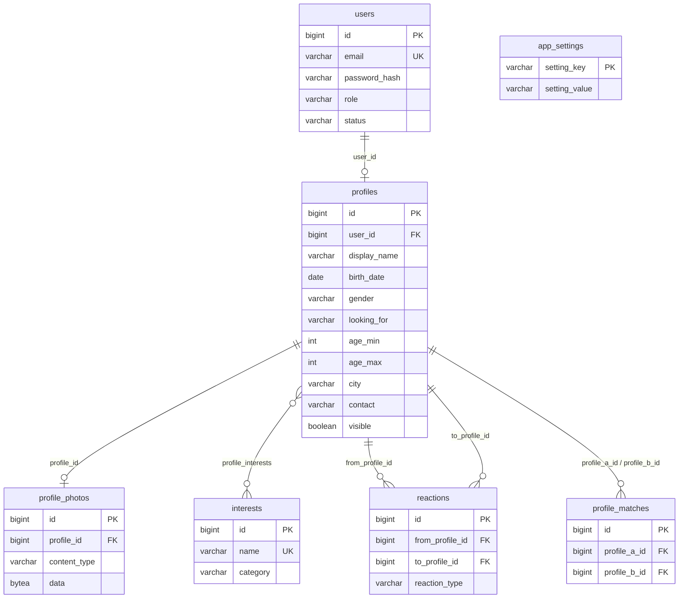

# Отчёт по учебной практике

**Тема:** модуль рекомендаций (Recommendation Module) в формате приложения для знакомств **Matchly**.

**Технологии:** Java 21, Spring Boot 4.1, Spring Security (JWT), Spring Data JPA, PostgreSQL 16, Flyway,
springdoc-openapi (Swagger), Lombok, SLF4J/Logback, JUnit 5, Mockito, H2 (тесты), HTML/CSS/JavaScript.

## 1. Постановка задачи

Требовалось реализовать полноценный backend-модуль на Spring с базой данных и Spring Security:
REST API с контроллерами, сервисами и репозиториями, CRUD-операции, аутентификация и авторизация,
Swagger, пользовательский интерфейс. Из предложенных тем выбран модуль рекомендаций: работа с сущностями
User, Item, Rating и формирование персональных рекомендаций.

В формате знакомств эти сущности получили естественное воплощение:

| Сущность из задания | В Matchly |
|---------------------|-----------|
| User | аккаунт (`User`) и анкета (`Profile`) |
| Item | чужая анкета, которую показывают в ленте |
| Rating | реакция `LIKE` / `SKIP` (`Reaction`) |

Такое соответствие делает модуль наглядным: пользователь видит, какие данные влияют на подборку, а каждая карточка
объясняет, почему она показана.

## 2. Соответствие базовым требованиям

| Требование | Как выполнено |
|------------|---------------|
| Модульность | Код разделён на пакеты по предметным областям (`auth`, `user`, `profile`, `interest`, `reaction`, `matching`, `recommendation`, `admin`, `settings`) и по слоям внутри каждого: контроллер, интерфейс сервиса и реализация, репозиторий, сущность, DTO, маппер. Общая инфраструктура вынесена в `common` и `config`. |
| ООП | Инкапсуляция: сущности меняют состояние только через осмысленные методы (`User.block()`, `Profile.update(...)`, `Reaction.change(...)`), сеттеров нет. Наследование: `BaseEntity` для всех сущностей, `MatchlyException` как корень иерархии ошибок, `AbstractRecommendationStrategy` для стратегий. Полиморфизм: интерфейс `RecommendationStrategy` с четырьмя реализациями, выбираемыми во время выполнения; обработчик ошибок работает с любым наследником `MatchlyException`. |
| Логирование и обработка ошибок | SLF4J + Logback: консоль и файл `logs/matchly.log` с ежедневной ротацией. Все исключения превращаются в ответ `application/problem+json` (RFC 9457) единым `@RestControllerAdvice`; ошибки безопасности (401/403) проходят через тот же обработчик. Прикладные исключения сами знают свой HTTP-статус. |
| Документирование | Javadoc у классов и публичных методов, комментарии в миграциях и конфигурации, аннотации OpenAPI (`@Tag`, `@Operation`, `@ApiResponse`), Swagger UI, README с инструкциями для Windows и Linux, данный отчёт и инструкция по интеграции. |
| Тестируемость | 81 автотест: 36 unit-тестов (сервисы с Mockito, доменные правила анкеты, алгоритмы стратегий на заранее известных матрицах) и 45 API-тестов (MockMvc, полный контекст Spring на H2). Плюс 18-шаговый браузерный сценарий Playwright. |

Требования к Spring-проекту: `@RestController`, `@Service`, `@Repository`, `@Entity` используются во всех модулях;
CRUD реализован для аккаунтов, анкет, интересов, реакций, матчей и настроек; аутентификация по JWT; подключение к PostgreSQL
через Spring Data JPA с миграциями Flyway; Swagger доступен по адресу `/swagger-ui.html`; интерфейс с навигацией и
объяснением рекомендаций.

## 3. Архитектура

### 3.1. Слои

```
HTTP  ->  Controller (валидация DTO, маппинг статусов)
      ->  Service (интерфейс + реализация, транзакции, бизнес-правила, логирование)
      ->  Repository (Spring Data JPA, JPQL-запросы)
      ->  Entity (инварианты предметной области)
```

Сущности наружу не отдаются: контроллеры работают только с DTO (`record`), преобразование делают мапперы
(`UserMapper`, `ProfileMapper`) и сборщики (`ProfileCardAssembler`, `MatchAssembler`), которые заодно
подгружают сведения о фото одним запросом.

### 3.2. Схема базы данных



Схема создаётся миграциями Flyway `V1`…`V4`. Все внешние ключи каскадные: удаление аккаунта убирает анкету, фото,
реакции и матчи одной операцией. SQL написан переносимо и выполняется как в PostgreSQL, так и в H2 (режим совместимости
с PostgreSQL) для тестов.

### 3.3. Безопасность

- Пароли хранятся в виде bcrypt-хэшей (`DelegatingPasswordEncoder`).
- JWT подписывается HMAC-SHA256 средствами Spring Security OAuth2 Resource Server (`NimbusJwtEncoder` / `NimbusJwtDecoder`), сторонние библиотеки не нужны.
- На каждом запросе пользователь читается из базы: заблокированные и удалённые аккаунты теряют доступ сразу, а не по истечении токена.
- Правила доступа: `/api/auth/register`, `/api/auth/login`, Swagger, health и статика открыты; `/api/admin/**` только для `ADMIN`; остальной `/api/**` для аутентифицированных.
- Фото анкет отдаются только аутентифицированным пользователям; интерфейс загружает их с токеном и показывает через blob-URL.
- Тип загружаемого изображения определяется по сигнатуре файла, а не по заголовку от клиента.

## 4. Модуль рекомендаций

### 4.1. Конвейер

1. **Жёсткие фильтры** (не зависят от алгоритма): анкета видима, владелец не заблокирован, это не сам пользователь,
   на анкету ещё не было реакции, и предпочтения взаимны (пол и возраст подходят обеим сторонам).
2. **Контекст** (`RecommendationContext`): текущая дата, матрица лайков «кто кого лайкнул» и число полученных лайков.
   Загружается один раз на запрос, стратегии в базу не ходят.
3. **Стратегия** оценивает каждого кандидата числом от 0 до 1 и списком причин.
4. **Сортировка** по оценке, затем по новизне анкеты; выдача первых N карточек.

### 4.2. Стратегии

Интерфейс `RecommendationStrategy` (паттерн «Стратегия») реализуют четыре класса. Реестр `StrategyRegistry`
собирает их из контекста Spring и проверяет, что для каждого значения `StrategyType` есть реализация, поэтому
новая стратегия добавляется одним классом без правок сервиса.

**По интересам (`CONTENT`).** Работает и для новичков без лайков.

```
score = 0.6 * J + 0.25 * A + 0.15 * C
J = |общие интересы| / |объединение интересов|        (коэффициент Жаккара)
A = max(0, 1 - |разница возрастов| / 15)
C = 1, если один город, иначе 0
```

**Похожие вкусы (`COLLABORATIVE`).** Коллаборативная фильтрация по пользователям. Для зрителя `v` с множеством лайков `L(v)`
и каждого другого пользователя `u`:

```
sim(v, u) = |L(v) ∩ L(u)| / sqrt(|L(v)| * |L(u)|)      (косинусная близость)
score(c)  = Σ sim(v, u) * [u лайкнул c] / Σ sim(v, u)
```

Без лайков у зрителя стратегия возвращает нули (холодный старт), и её место занимает содержание анкет.

**Популярные (`POPULARITY`).** `score(c) = лайки(c) / max лайков среди кандидатов`.

**Умная подборка (`HYBRID`).** Взвешенная сумма трёх оценок плюс бонус за взаимный интерес:

```
score = 0.5 * content + 0.3 * collaborative + 0.2 * popularity + 0.15 * [кандидат уже лайкнул зрителя]
```

Результат ограничивается единицей. Причины всех составляющих объединяются и показываются на карточке
(«Общие интересы: Кино, Кофе», «Нравится 4 пользователям с похожими вкусами», «Проявил(а) интерес к вам»).

Алгоритм по умолчанию хранится в таблице `app_settings` и меняется администратором без перезапуска;
пользователь может выбрать любой алгоритм в интерфейсе.

### 4.3. Проверка алгоритмов

Каждая стратегия покрыта unit-тестами на маленьких матрицах с заранее рассчитанными значениями: идентичные анкеты дают 1.0,
непохожие 0, веса применяются покомпонентно, косинусная близость взвешивает «советчиков», холодный старт даёт нули,
бонус за встречный лайк добавляется, оценка не превышает 1. API-тест проверяет фильтрацию (скрытые, уже оценённые,
несовместимые по предпочтениям анкеты не попадают в выдачу) и порядок карточек для каждой стратегии.

## 5. REST API

| Метод и путь | Назначение | Доступ |
|--------------|------------|--------|
| `POST /api/auth/register`, `POST /api/auth/login` | регистрация и вход, выдача JWT | все |
| `GET /api/auth/me`, `DELETE /api/auth/me` | текущий аккаунт, удаление своего аккаунта | пользователь |
| `GET /api/interests` | справочник интересов | пользователь |
| `GET /api/profiles/me`, `PUT /api/profiles/me` | своя анкета (создание и редактирование) | пользователь |
| `PUT /api/profiles/me/photo`, `DELETE /api/profiles/me/photo` | загрузка и удаление фото | пользователь |
| `GET /api/profiles/{id}`, `GET /api/profiles/{id}/photo` | карточка и фото другой анкеты | пользователь |
| `GET /api/recommendations?strategy=&limit=` | подборка с объяснениями | пользователь |
| `GET /api/recommendations/strategies` | список алгоритмов | пользователь |
| `POST /api/reactions` | лайк или пропуск; при взаимности возвращает матч | пользователь |
| `GET /api/matches`, `DELETE /api/matches/{id}` | матчи с контактами, разрыв матча | пользователь |
| `GET /api/admin/users`, `GET /api/admin/users/{id}` | список и карточка аккаунта | админ |
| `POST /api/admin/users/{id}/block`, `.../unblock`, `DELETE /api/admin/users/{id}` | блокировка и удаление | админ |
| `POST/PUT/DELETE /api/admin/interests` | ведение справочника интересов | админ |
| `GET/PUT /api/admin/settings` | алгоритм по умолчанию | админ |
| `GET /api/admin/stats` | сводная статистика | админ |

Формат ошибок единый:

```json
{ "status": 409, "title": "Conflict", "detail": "Email is already registered", "instance": "/api/auth/register", "timestamp": "..." }
```

Ошибки валидации дополнительно содержат список `errors` с полями и сообщениями. Полное описание с примерами доступно в Swagger UI
(`docs/screenshots/09-swagger.png`).

## 6. Пользовательский интерфейс

Одностраничное приложение на чистом JavaScript (без фреймворков и сборки) обслуживается тем же Spring Boot из `static/`
и работает с REST API через JWT, то есть интерфейс одновременно демонстрирует API.

| Экран | Скриншот |
|-------|----------|
| Вход и регистрация с подсказками валидации под полями | `docs/screenshots/01-login.png` |
| Лента: карточка, оценка совпадения, причины показа, выбор алгоритма, клавиши ← и → | `docs/screenshots/02-discover.png` |
| Матчи с контактами и кнопкой копирования | `docs/screenshots/03-matches.png` |
| Анкета: онбординг и редактирование, фото, интересы по категориям, видимость | `docs/screenshots/04-profile.png` |
| Админ: статистика, пользователи, интересы, настройки | `docs/screenshots/05-admin-stats.png` … `08-admin-settings.png` |
| Мобильная вёрстка (400px) | `docs/screenshots/10-mobile.png` |

UX-решения: онбординг открывается автоматически, пока анкета не заполнена; взаимный лайк показывает окно «Это матч!»
с контактом; пустые состояния объясняют, что делать дальше; опасные действия требуют подтверждения; ошибки сервера
показываются под полями формы или всплывающим уведомлением.

## 7. Тестирование

| Вид | Что проверяется | Кол-во |
|-----|-----------------|--------|
| Unit (JUnit 5, Mockito) | сервис аутентификации, выдача и проверка JWT, правила анкеты (возраст, диапазон, нормализация), совместимость предпочтений, матч, определение типа изображения, четыре стратегии рекомендаций | 36 |
| API (MockMvc, контекст Spring, H2) | регистрация и вход, формат ошибок, права доступа, блокировка с мгновенным отзывом токена, каскадное удаление, анкеты и фото, справочник, реакции и матчи, рекомендации и настройки, статистика, генератор демо-данных | 45 |
| Сквозные (Playwright, Chromium) | 18 шагов пользовательского пути в реальном браузере, проверка отсутствия ошибок консоли и горизонтальной прокрутки на 400px | 1 сценарий |

Дополнительно каждый этап проверялся вживую на PostgreSQL 16: старт приложения, миграции, запросы через `curl`,
содержимое таблиц.

Запуск: `./mvnw test` (Windows: `mvnw.cmd test`). Тесты не требуют PostgreSQL и Docker.

## 8. Запуск и интеграция

Инструкции по установке и запуску на Windows и Linux: [README.md](../README.md).
Как использовать модуль рекомендаций в другом приложении: [INTEGRATION.md](INTEGRATION.md).

## 9. Итоги и возможные развития

Реализован законченный сервис: аутентификация, анкеты, реакции, матчи, четыре взаимозаменяемых алгоритма рекомендаций
с объяснениями, панель администратора, интерфейс, документация и тесты. Модуль рекомендаций изолирован и расширяем.

Возможные развития: обмен сообщениями внутри матча (WebSocket), несколько фото в анкете, геолокация и расстояние как
составляющая оценки, обучение весов гибрида на реальных матчах, кэширование матрицы лайков для больших объёмов данных,
подтверждение email.
